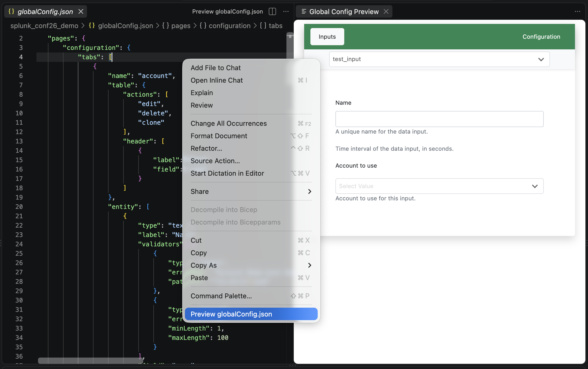
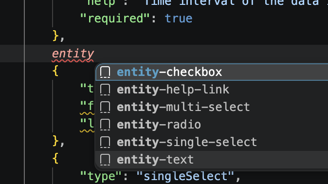

# Starter prompt:

Here is the exact prompt I used to build a Splunk add-on with `ucc-gen`

```
using the documentation located at https://splunk.github.io/addonfactory-ucc-generator/ create a Splunk add-on for me
```

:bulb: Note: The model I used was `Claude Sonnet 5 (High)`

<details>
<summary>And here is the output from the prompt</summary>

  ---

```
  User: using the documentation located at https://splunk.github.io/addonfactory-ucc-generator/ create a Splunk add-on for me
  GitHub Copilot: Updated todo list
  
  Fetched https://splunk.github.io/addonfactory-ucc-generator/
  
  Fetched 3 resources
  Analyzing your answers...
  
  Execution complete: Set up UCC and generate add-on
  
  Ran terminal command:  { echo '>>> 1. python3 --version'; python3 --version; echo '>>> 2. python3 -m venv .venv'; python3 -m venv .venv; echo '>>> 3. source .venv/bin/activate && pip install --upgrade pip'; source .venv/bin/activate && pip install --upgrade pip; echo '>>> 4. source .venv/bin/activate && pip install splunk-add-on-ucc-framework'; source .venv/bin/activate && pip install splunk-add-on-ucc-framework; echo '>>> 5. source .venv/bin/activate && ucc-gen --version'; source .venv/bin/activate && ucc-gen --version; echo '>>> 6. source .venv/bin/activate && ucc-gen init --addon-name "splunk_conf26_demo" --addon-display-name "Splunk .conf26 Demo" --addon-input-name test_input --overwrite'; source .venv/bin/activate && ucc-gen init --addon-name "splunk_conf26_demo" --addon-display-name "Splunk .conf26 Demo" --addon-input-name test_input --overwrite; echo '>>> 7. find splunk_conf26_demo -maxdepth 2 -print'; find /Users/jconger/Dev/Splunk.conf26/splunk_conf26_demo -maxdepth 2 -print; } 2>&1

  Ran terminal command:  cat '/Users/jconger/Library/Application Support/Code/User/workspaceStorage/3fa49c788d1b9c086999e3f117843def/GitHub.copilot-chat/chat-session-resources/f1e2ada7-a9ef-454d-86c0-da7065b2b91e/call_KdIXtpendiEb5ZvQ4ejZG7L2__vscode-1789006368636/content.txt'

  Ran terminal command:  f='/Users/jconger/Library/Application Support/Code/User/workspaceStorage/3fa49c788d1b9c086999e3f117843def/GitHub.copilot-chat/chat-session-resources/f1e2ada7-a9ef-454d-86c0-da7065b2b91e/call_KdIXtpendiEb5ZvQ4ejZG7L2__vscode-1789006368636/content.txt'; wc -l "$f"; sed -n '1,240p' "$f"

  Ran terminal command:  f='/Users/jconger/Library/Application Support/Code/User/workspaceStorage/3fa49c788d1b9c086999e3f117843def/GitHub.copilot-chat/chat-session-resources/f1e2ada7-a9ef-454d-86c0-da7065b2b91e/call_KdIXtpendiEb5ZvQ4ejZG7L2__vscode-1789006368636/content.txt'; sed -n '1,100p' "$f"

  Ran terminal command:  f='/Users/jconger/Library/Application Support/Code/User/workspaceStorage/3fa49c788d1b9c086999e3f117843def/GitHub.copilot-chat/chat-session-resources/f1e2ada7-a9ef-454d-86c0-da7065b2b91e/call_KdIXtpendiEb5ZvQ4ejZG7L2__vscode-1789006368636/content.txt'; tail -80 "$f"

  Execution complete: Build the generated add-on
  
  Ran terminal command:  source .venv/bin/activate && ucc-gen build --source splunk_conf26_demo/package --ta-version 1.0.0; exit_code=$?; printf '\n=== ucc-gen exit code: %s ===\n' "$exit_code"; if [[ -d /Users/jconger/Dev/Splunk.conf26/output ]]; then printf '\n=== output directory (max depth 2) ===\n'; find /Users/jconger/Dev/Splunk.conf26/output -maxdepth 2 -print; else printf '\n=== output directory not created ===\n'; fi; exit "$exit_code"
  
  Ran terminal command:  cat '/Users/jconger/Library/Application Support/Code/User/workspaceStorage/3fa49c788d1b9c086999e3f117843def/GitHub.copilot-chat/chat-session-resources/f1e2ada7-a9ef-454d-86c0-da7065b2b91e/call_0BSDPn3iyh8ewUJM9QJrd3jE__vscode-1789006368642/content.txt'
  
  Ran terminal command:  content='/Users/jconger/Library/Application Support/Code/User/workspaceStorage/3fa49c788d1b9c086999e3f117843def/GitHub.copilot-chat/chat-session-resources/f1e2ada7-a9ef-454d-86c0-da7065b2b91e/call_0KRW7WZKspVPTGQCKFZvrJX__vscode-1789006368643/content.txt'; wc -c "$content"; head -c 18000 "$content"
  
  Ran terminal command:  content='/Users/jconger/Library/Application Support/Code/User/workspaceStorage/3fa49c788d1b9c086999e3f117843def/GitHub.copilot-chat/chat-session-resources/f1e2ada7-a9ef-454d-86c0-da7065b2b91e/call_0KRW7WZKxSpVPTGQCKFZvrJX__vscode-1789006368643/content.txt'; printf '%s\n' '=== captured output size ==='; wc -c "$content"; printf '%s\n' '=== captured output ==='; cat "$content"
  
  Ran terminal command:  content='/Users/jconger/Library/Application Support/Code/User/workspaceStorage/3fa49c788d1b9c086999e3f117843def/GitHub.copilot-chat/chat-session-resources/f1e2ada7-a9ef-454d-86c0-da7065b2b91e/call_9fLxCnPuRE3oVGOzZnebnDuP__vscode-1789006368645/content.txt'; wc -l "$content"; sed -n '1,160p' "$content"
  
  Ran terminal command:  content='/Users/jconger/Library/Application Support/Code/User/workspaceStorage/3fa49c788d1b9c086999e3f117843def/GitHub.copilot-chat/chat-session-resources/f1e2ada7-a9ef-454d-86c0-da7065b2b91e/call_kA7dr4PBaKldJlPrn3fSewZu__vscode-1789006368646/content.txt'; if [[ -f "$content" ]]; then wc -l "$content"; sed -n '1,100p' "$content"; else find '/Users/jconger/Library/Application Support/Code/User/workspaceStorage/3fa49c788d1b9c086999e3f117843def/GitHub.copilot-chat/chat-session-resources/f1e2ada7-a9ef-454d-86c0-da7065b2b91e' -name content.txt -print; fi
  
  Ran terminal command:  content='/Users/jconger/Library/Application Support/Code/User/workspaceStorage/3fa49c788d1b9c086999e3f117843def/GitHub.copilot-chat/chat-session-resources/f1e2ada7-a9ef-454d-86c0-da7065b2b91e/call_0BSDPn3iyh8ewUJM9QJrd3jE__vscode-1789006368642/content.txt'; wc -l "$content"; sed -n '1,120p' "$content"
  
  Ran terminal command:  source .venv/bin/activate && ucc-gen build --source splunk_conf26_demo/package --ta-version 1.0.0 2>&1; exit_code=$?; printf '\n=== ucc-gen exit code: %s ===\n' "$exit_code"; if [[ -d output ]]; then printf '\n=== output directory (max depth 2) ===\n'; find output -maxdepth 2 -print; else printf '\n=== output directory not created ===\n'; fi; exit 0
  
  Build succeeded. Now packaging it into an installable archive and updating `.gitignore` to exclude generated build artifacts and the virtual environment. 
  
  Execution complete: Package the built add-on
  
  Ran terminal command:  source .venv/bin/activate && ucc-gen package --path output/splunk_conf26_demo
  
  Created 4 todos
  
  Now update `.gitignore` to exclude build outputs and the venv, and confirm the generated add-on structure. 
  
  Read , lines 1 to 30
  
  Good — `.venv` and `*.tar.gz` are already ignored. Let's also ignore the UCC `output` build folder specifically. 
  
  Replacing 3 lines with 4 lines in 
  
  Created and built a UCC-based Splunk add-on:
  
  - **Source add-on**: `splunk_conf26_demo` — contains `globalConfig.json`, `package/` (with `app.manifest`, `bin/`, `lib/`)
  - **Built add-on**: `splunk_conf26_demo` — full installable app with generated `.conf` files, UI, and the `test_input` modular input
  - **Package**: `splunk_conf26_demo-1.0.0.tar.gz` — installable archive, ready to upload to Splunk
  - Python venv (`.venv`) created with `splunk-add-on-ucc-framework` 5.52.0 installed
  - Updated `.gitignore` to exclude `output`, `.tar.gz` packages, and `.venv`
  
  To customize inputs/fields, edit `globalConfig.json`, then rebuild with:
  
  source .venv/bin/activate
  ucc-gen build --source splunk_conf26_demo/package --ta-version 1.0.0
  ucc-gen package --path output/splunk_conf26_demo
  
  
  Install the `.tar.gz` in your Splunk instance via **Manage Apps → Install app from file**.
  
  Completed: *Set up UCC and generate add-on* (1/4)
  
  Made changes.

 ```
 
  ---
</details>

:clock1: Total time to build the add-on from scratch - **2:49**

Notice some things that happened:
* Created a virtual environment
* Installed `ucc-gen` in the environment
* Built the add-on
* Packaged the add-on
* Updated `.gitignore` to ensure the `output` directory, `.venv` directory, and and resulting `tar.gz` distribution package are not checked into Git source control
* Gave instructions for next steps

## :warning: Python Version Warning
If your Python version is 3.14.0 or above, the `.venv` environment created will not pull in the correct version of `ucc-gen`.  We need version `ucc-gen 6.6.0` for our demos.  If your Python version is 3.14.n, you won't get the right `ucc-gen` version and will get some `<TypeError>` messages when trying to use the add-on in Splunk.

Try this:

```
python3.13 -m venv .venv
source .venv/bin/activate
```

<details>
<summary>What you might see trying to install ucc-gen 6.6.0 with Python 3.14.n</summary>
  
> ERROR: Ignored the following versions that require a different python version: 5.53.0 Requires-Python >=3.7,<3.13; 5.53.1 Requires-Python >=3.7,<3.13; 5.53.2 Requires-Python >=3.7,<3.13; 5.54.0 Requires-Python >=3.7,<3.13; 5.55.0 Requires-Python >=3.7,<3.13; 5.56.0 Requires-Python >=3.7,<3.14; 5.57.0 Requires-Python >=3.7,<3.14; 5.57.1 Requires-Python >=3.7,<3.14; 5.57.2 Requires-Python >=3.7,<3.14; 5.58.0 Requires-Python >=3.7,<3.14; 5.58.1 Requires-Python >=3.7,<3.14; 5.59.0 Requires-Python >=3.7,<3.14; 5.60.0 Requires-Python >=3.7,<3.14; 5.61.0 Requires-Python >=3.7,<3.14; 5.62.0 Requires-Python >=3.7,<3.14; 5.63.0 Requires-Python >=3.7,<3.14; 5.64.0 Requires-Python >=3.7,<3.14; 5.65.0 Requires-Python >=3.7,<3.14; 5.66.0 Requires-Python >=3.7,<3.14; 5.67.0 Requires-Python >=3.7,<3.14; 5.68.0 Requires-Python >=3.7,<3.14; 5.68.1 Requires-Python >=3.7,<3.14; 5.69.0 Requires-Python >=3.7,<3.14; 5.69.1 Requires-Python >=3.7,<3.14; 5.70.0 Requires-Python >=3.9,<3.14; 5.70.0rc1 Requires-Python >=3.9,<3.14; 6.0.0 Requires-Python >=3.9,<3.14; 6.0.0a1 Requires-Python >=3.9,<3.14; 6.0.0rc1 Requires-Python >=3.9,<3.14; 6.0.1 Requires-Python >=3.9,<3.14; 6.1.0 Requires-Python >=3.9,<3.14; 6.2.0 Requires-Python >=3.9,<3.14; 6.3.0 Requires-Python >=3.9,<3.14; 6.4.0 Requires-Python >=3.9,<3.14; 6.5.0 Requires-Python >=3.9,<3.14; 6.5.1 Requires-Python >=3.9,<3.14; 6.5.2 Requires-Python >=3.9,<3.14; 6.5.3 Requires-Python >=3.9,<3.14; **6.6.0 Requires-Python >=3.9,<3.14**
> 
> ERROR: Could not find a version that satisfies the requirement splunk_add_on_ucc_framework==6.6.0 (from versions: 4.0.2, 4.0.4, 4.0.8, 4.0.10, 4.1.2, 4.1.3, 4.1.5, 4.1.7, 4.1.10, 4.1.11, 4.1.12, 4.2.0, 4.2.1, 4.2.2, 4.2.3, 4.2.4, 4.3.0, 4.4.0, 4.5.0, 5.0.0, 5.0.1, 5.0.2, 5.0.3, 5.1.0, 5.2.0, 5.2.1, 5.3.0, 5.3.1, 5.3.2, 5.3.3, 5.3.4, 5.4.0, 5.4.1, 5.4.2, 5.4.3, 5.5.0, 5.5.1, 5.5.2, 5.5.3, 5.5.4, 5.5.5, 5.5.6, 5.5.7, 5.5.8, 5.5.9, 5.6.0, 5.6.1, 5.6.2, 5.7.0, 5.8.0, 5.8.1, 5.8.2, 5.9.0, 5.10.0, 5.10.1, 5.10.2, 5.10.3, 5.10.4, 5.11.0, 5.12.0, 5.13.0, 5.13.2, 5.14.0, 5.14.1, 5.14.2, 5.15.0, 5.15.1, 5.16.0, 5.16.1, 5.17.0, 5.17.1, 5.18.0, 5.19.0, 5.20.0, 5.21.0, 5.22.0, 5.23.0, 5.23.1, 5.23.2, 5.24.0, 5.25.0, 5.26.0, 5.27.0, 5.27.1, 5.27.2, 5.27.3, 5.28.0, 5.28.1, 5.28.2, 5.28.3, 5.28.4, 5.28.5, 5.28.6, 5.29.0, 5.30.0, 5.31.0b1, 5.31.0, 5.31.1b1, 5.31.1, 5.32.0, 5.33.0, 5.34.0, 5.34.1, 5.35.0, 5.35.1, 5.36.0, 5.36.1, 5.36.2, 5.37.0, 5.38.0, 5.39.0, 5.39.1, 5.40.0, 5.41.0, 5.42.0, 5.42.1, 5.43.0, 5.44.0, 5.45.0, 5.46.0, 5.47.0, 5.48.0, 5.48.1, 5.48.2, 5.49.0, 5.50.0, 5.50.1, 5.51.0, 5.51.1, 5.52.0, 6.0.0b1, 6.0.0b2)
> 
> ERROR: No matching distribution found for splunk_add_on_ucc_framework==6.6.0

</details>

## (Optional) Create a symbolic link from output/splunk_conf26_demo $SPLUNK_HOME/etc/apps

I like to create a symbolic link so that the source code can live in a repo outside of my Splunk install. You could have your AI agent do this, but it is simple enough to not burn more tokens :smile:  

Also, this way you don't have to copy/paste the contents of the `output` directory over and over as you build.

Example:

`ln -s <source> <destination>`

Real example (from my Mac):

`ln -s ~/Dev/Splunk.conf26/output/splunk_conf26_demo /Applications/Splunk/etc/apps/splunk_conf26_demo`

## View the UI `ucc-gen` created in VSCode

The UI for UCC add-ons is defined in a file named `globalConfig.json`.  It isn't horrible to read the json, but right-click on the file in VSCode, choose "Preview globalConfig.json" to see changes in real time as you make changes



## Add a field to the input

The UI for the field is done in `globalConfig.json`, but the wiring for the field is in the input's Python.

### Method 1 - just type it in
The JSON will validate as you type, and you can [follow along with the docs](https://splunk.github.io/addonfactory-ucc-generator/) on what goes where.

### Method 2 - use a snippet
The VSCode extension ships with several snippets you can use in `globalConfig.json`.  Just start typing one of the following, and a scaffold will be created for the field (entity):

* `entity-text` creates a text box
* `entity-checkbox` creates a checkbox (who would have thought? :shrug:)
* `entity-radio` you get the gist by now
* `entity-single-select`
* `entity-multi-select`
* `entity-help-link`




### Method 3 - use a skill
The VSCode extension ships with a skill to create these fields/entities.

#### Sample prompts

```
add a new field to the test_input
```

```
add a validator to the new field
```

```
build the add-on
```

The skill will load and ask you questions about how you want the field to be created (text field, checkbox, select, etc.).


