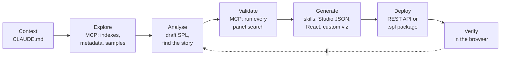

# Building Splunk dashboards with AI

A field guide for connecting an AI coding agent to Splunk and using it to explore
data, write and validate SPL, and ship dashboards — safely.

Everything here was learned building a real dashboard set live: six months of
home-energy telemetry, 14 million events, two prompts, content installed in
Splunk. Examples use Claude Code; the ideas carry to any agent that supports
MCP and skills.

**Starter kit:** [`starter-kit/`](starter-kit/README.md) — MCP configs, permission
rules, a seed Dashboard Studio skill, a `CLAUDE.md` template and filled example,
prompt templates, a sandbox app, a least-privilege role, and a worked dashboard
that runs on any Splunk instance.

---

## Contents

1. [How it works](#1-how-it-works)
2. [Requirements](#2-requirements)
3. [Know before you start](#3-know-before-you-start)
4. [Critical skills](#4-critical-skills)
5. [What the Splunk MCP server does](#5-what-the-splunk-mcp-server-does)
6. [Connecting the Splunk MCP server](#6-connecting-the-splunk-mcp-server)
7. [API access and security](#7-api-access-and-security)
8. [Writing a good dashboard prompt](#8-writing-a-good-dashboard-prompt)
9. [Debugging](#9-debugging)
10. [Links](#10-links)

---

## 1. How it works

An agent building a dashboard runs the same loop a Splunk engineer does — it
just runs it faster, and it needs the same three things you do: access to the
data, knowledge of the platform, and context about *this* data.



| Layer | What it is | What it contributes |
|---|---|---|
| **Model** | The agent (Claude Code, Codex, Cursor…) | Reasoning, SPL, code, design |
| **Tools** | Splunk MCP server (read), REST API (write) | Eyes on the real instance; a way to ship |
| **Knowledge** | Skills + your `CLAUDE.md` | Platform rules the model doesn't reliably know; facts about your data it can't guess |

The knowledge layer is the one people skip, and the one that decides whether
the output works. A model will confidently write `is_scheduled = 1` in
`savedsearches.conf`. It reads correctly. It is not a valid key, and Splunk
logs an error on every restart. A skill that lists the banned keys prevents it;
the model alone does not.

**Separate analysis from building.** Ask for findings first, then ask for a
dashboard of those findings. Dashboards built before the story is known turn
into walls of tables.

---

## 2. Requirements

### Splunk side

| Requirement | Detail |
|---|---|
| **Splunk MCP Server app** | [Splunkbase app 7931](https://splunkbase.splunk.com/app/7931). Preinstalled for eligible Splunk Cloud customers from 10.6. |
| **Capability `mcp_tool_execute`** | On every role that should use MCP tools. |
| **Token creation rights** | `edit_tokens_own` + `mcp_tool_admin` to create your own encrypted MCP token (not needed with OAuth). |
| **OAuth (optional, recommended)** | Splunk Cloud 10.3.2512.11+ in AWS regions, MCP app 1.2.1+, an OAuth client created by an admin. GA from Splunk Cloud 10.5. |
| **Splunk AI Assistant for SPL (optional)** | Required for the `saia_*` tools (generate / explain / optimise SPL). |
| **REST API access (optional)** | Only if the agent should *write* to Splunk. On Splunk Cloud, port 8089 must be allowlisted for your IP — see [section 7](#7-api-access-and-security). Not available on Splunk Cloud trials. |
| **Splunk 10.4+** | Only for Dashboard Studio *extension* custom visualizations. |
| **A sandbox app** | Somewhere the agent's output can land without touching production content. [`starter-kit/splunk/ai_sandbox`](starter-kit/splunk/ai_sandbox/) passes AppInspect Cloud checks. |

### Your machine

| Requirement | Detail |
|---|---|
| **An MCP-capable agent** | Examples here use [Claude Code](https://code.claude.com/docs/en/mcp). |
| **Node.js 22+** | `mcp-remote` (token connections) and the custom-viz tooling. |
| **Python 3, curl** | The starter-kit REST helper. |
| **Git** | Clone the skills repos. |

---

## 3. Know before you start

**The data comes first.** The agent cannot design around data it hasn't
profiled. Budget the first prompt for exploration and findings, not panels.

**Write a `CLAUDE.md`.** It loads into every session and is the single biggest
lever on output quality. Put in: where the data lives, one real event, the
extraction preamble, valid time windows, fields that are broken, known
anomalies, and indexes that are off limits. Every fact you write down is a
search the agent doesn't run and a guess it doesn't make.
Template: [`starter-kit/CLAUDE.md.template`](starter-kit/CLAUDE.md.template).
Filled-in example: [`starter-kit/examples/CLAUDE.md.example`](starter-kit/examples/CLAUDE.md.example).

**Raw scans are expensive — and the MCP caps them.** `splunk_run_query` stops
after **1 minute** and returns at most **1,000 rows**. In our demo an
hour-of-day profile over the raw index scanned 5.3M events in 38s; the full
analysis took 162s raw against **5.6s from summary-index rollups**. Build
rollups (`collect` / scheduled summary indexing) for anything you'll analyse
repeatedly, and document them in `CLAUDE.md` *with the measured cost* — the
agent picks the cheap path when it can see the price.

**Use absolute time ranges** for historical work. A relative range (`-24h`)
lands in feed gaps and renders empty panels in front of your audience.

**Verify "there is no data" claims.** Agents produce confident false negatives:
a sourcetype pattern that misses one sourcetype, `stats … by a, b` silently
dropping rows where `b` is null, a second event shape in the same index. Ask
for the search that proved the absence.

**The agent sees everything your role sees.** If the instance holds personal or
regulated data, use a role scoped to the indexes this work needs — not your
admin account — and list off-limits indexes in `CLAUDE.md`.

**Pick the dashboard technology up front.**

| Choose | When | Skill |
|---|---|---|
| **Dashboard Studio** (JSON) | Most dashboards. Native, editable by others, no build step. | `studio-dashboards` (starter kit — no public skill yet) |
| **Studio extension** (custom viz) | A panel Studio can't draw. Splunk 10.4+. | `custom-visualization-builder`, `splunk-viz` |
| **Legacy custom viz** | Pre-10.4, Simple XML, saved reports. | `splunk-viz` |
| **React app page** (Splunk UI Toolkit) | A bespoke, app-like experience. Most moving parts. | — |
| **Convert Simple XML → Studio** | Modernising existing dashboards. | `splunk-dashboard-converter` |

**Splunk Cloud has extra rules.** Private apps must pass AppInspect vetting.
Some things that work on Enterprise don't on Cloud — for example, app pages
served from Mako templates return a 500; host React pages from a Simple XML view
instead. `sc_admin` cannot install apps over REST; upload the `.spl` in the UI.

**Be a good neighbour on shared instances.** No email or webhook alert actions
unless someone asked for them; track alerts in *Triggered Alerts* instead.

---

## 4. Critical skills

A **skill** is a folder with a `SKILL.md`: instructions, references and scripts
an agent loads when a task matches. Skills carry the platform knowledge models
get wrong — valid config keys, framework boundaries, packaging rules.

> Both repos below are community/experimental. Splunk Agent Skills are **not
> covered by Splunk support contracts**. Read each `SKILL.md` before use — many
> are deliberately advisory-only and will not change your deployment.

### Repositories

| Repo | What | Licence |
|---|---|---|
| [splunk/splunk-agent-skills](https://github.com/splunk/splunk-agent-skills) | 32 skills: search, performance, troubleshooting, dashboards, alerts, apps, Cloud admin | Apache 2.0 |
| [rcastley/splunk-custom-visualizations](https://github.com/rcastley/splunk-custom-visualizations) | `splunk-viz` skill + 29 example visualizations + a [browser test harness](https://rcastley.github.io/splunk-custom-visualizations/) | Apache 2.0 |

### Install

```bash
# See what's available
npx skills add splunk/splunk-agent-skills --list

# Install all Splunk Agent Skills into this project for Claude Code
npx skills add splunk/splunk-agent-skills --skill '*' --agent claude-code --copy --yes

# Or just one
npx skills add splunk/splunk-agent-skills --skill splunk-dashboard-converter --agent claude-code --copy --yes
```

`--agent` also accepts `codex`, `cursor`, `github-copilot`, `gemini-cli`,
`opencode`. For `splunk-viz`, clone the repo and open it in your agent — the
skill is discovered from `.agents/skills/` (and `.claude/skills/` for Claude
Code).

### The skills that matter for dashboards

| Job | Skill | Repo |
|---|---|---|
| Run bounded searches, keep large results out of context | `splunk-search` | agent-skills |
| Make a slow panel search fast, same results | `search-performance-optimizer` | agent-skills |
| Diagnose broken searches, dashboards, alerts | `search-and-dashboard-troubleshooter` | agent-skills |
| Dashboard / report latency, refresh, fan-out | `dashboard-report-alert-performance-advisor` | agent-skills |
| Summary / data-model acceleration readiness | `data-model-and-search-acceleration` | agent-skills |
| Simple XML → Dashboard Studio | `splunk-dashboard-converter` | agent-skills |
| Custom panel (Studio extension, 10.4+) | `custom-visualization-builder` | agent-skills |
| Custom panel (Studio extension *or* legacy) | `splunk-viz` | custom-visualizations |
| Scheduled report contracts | `report-authoring-specialist` | agent-skills |
| Alert readiness and delivery | `alerting-and-notable-workflows` | agent-skills |
| Package, validate, install an app | `app-and-add-on-lifecycle-advisor` | agent-skills |
| Ownership, permissions, naming of what you create | `knowledge-object-governance` | agent-skills |
| Allowlist your IP for REST on Splunk Cloud | `splunk-cloud-admin-copilot` | agent-skills |

### Write your own

There is no public skill yet for authoring Dashboard Studio JSON from scratch.
The starter kit ships a seed one —
[`studio-dashboards`](starter-kit/.claude/skills/studio-dashboards/SKILL.md) —
with `check_definition.py`, which catches broken references, legacy `viz.*`
types and option names Studio silently ignores. Grow it. Small skills work well:

```text
.claude/skills/studio-dashboards/
  SKILL.md          # name, description (when to load), the rules
  references/
    viz-options.md  # valid options per splunk.* type
```

Put in what you've seen go wrong: invalid keys and their correct replacements,
the `<dashboard version="2">` wrapper, your colour palette, "charts over
tables", "every panel search validated before shipping". The `description`
line decides when the skill loads — name the words users actually type.

---

## 5. What the Splunk MCP server does

The [Model Context Protocol](https://modelcontextprotocol.io) is a standard way
for an agent to call tools on another system. The Splunk MCP server runs *inside*
Splunk and exposes Splunk as a set of tools, under the calling user's own roles.

### It is read-only

No tool creates, changes or deletes Splunk objects. `splunk_run_query` refuses
searches containing commands it deems unsafe or destructive. Writing a dashboard
to Splunk is a separate step — see [section 7](#7-api-access-and-security).

### Tools

| Tool | Use in dashboard work |
|---|---|
| `splunk_get_info` | Version and platform — decides which features and viz frameworks apply |
| `splunk_get_indexes` / `splunk_get_index_info` | Find where the data lives; check event counts and time span |
| `splunk_get_metadata` | Hosts, sources, sourcetypes — catch the second sourcetype before it bites |
| `splunk_run_query` | Profile fields, test every panel search (1-min limit, 1,000 rows) |
| `splunk_run_saved_search` *(beta)* | Run an existing report instead of rewriting it |
| `splunk_get_knowledge_objects` | Existing saved searches, macros, lookups — reuse, don't duplicate |
| `splunk_get_kv_store_collections` | Lookup-backed panels |
| `splunk_get_user_info` / `splunk_get_user_list` | What the current role can see |
| `splunk_list_alerts` / `splunk_get_alert_details` *(2.0)* | Review the alert estate before adding to it |
| `splunk_list_fired_alerts` / `splunk_get_fired_alert_details` *(2.0)* | Did the new alert fire as backtested? |
| `splunk_get_alert_throttle` *(2.0)* | Check suppression settings |
| `saia_generate_spl` / `saia_explain_spl` / `saia_optimize_spl` / `saia_ask_splunk_question` | Requires AI Assistant for SPL |

MCP Server 2.0 also accepts SPL2 in `splunk_run_query` with an `@spl2` prefix
(including federated search), and lets admins register custom tools.

### Guardrails admins control

- **Tool enable/disable** server-wide, and **role-to-tool mapping**.
- **Rate limits** globally and per tool; **timeouts**; **default row limit**.
- **Encrypted tokens** that only work for MCP — they can't be replayed against
  the REST API.
- **Audit:** searches issued through MCP carry a provenance label into `_audit`.

### How it helps build dashboards

1. **Grounding.** The agent looks at real events instead of guessing field
   names, units and shapes.
2. **Validation.** Every panel search runs against the instance *before* it goes
   into a definition, so nothing ships that renders "No results found".
3. **Reuse.** Existing reports and macros are discovered, not reinvented.
4. **Verification after deploy.** Re-run the dashboard's own searches and
   compare against what the analysis reported.

---

## 6. Connecting the Splunk MCP server

Get the endpoint from your MCP Server app. It is normally:

```text
https://<your-stack>.splunkcloud.com:8089/services/mcp
```

### Option A — OAuth (recommended where available)

No secret in any config file; you sign in through the browser and Claude Code
refreshes the session. Your Splunk admin creates an OAuth client under
**Settings → Authentication methods → Splunk OAuth Clients** with redirect URI
`http://localhost:8080/callback`, and gives you the **client ID** and
**client secret**.

```bash
export SPLUNK_STACK='<your-stack>.splunkcloud.com'

claude mcp add-json splunk \
  '{"type":"http","url":"https://'"$SPLUNK_STACK"':8089/services/mcp","oauth":{"clientId":"<client-id>","callbackPort":8080,"scopes":"openid offline_access"}}' \
  --client-secret
```

`--client-secret` prompts for the secret with masked input and stores it in the
system keychain (macOS) or credentials file — never in the config. Then run
`/mcp` in Claude Code and choose the server to sign in.

> Pin `scopes` to `openid offline_access`. Splunk's OAuth server advertises more
> scopes than most MCP clients handle, which causes sign-in errors.

Project-shared version: [`starter-kit/.mcp.json.oauth.example`](starter-kit/.mcp.json.oauth.example).
The `callbackPort` must match the port in the redirect URI your admin registered.

### Option B — Encrypted MCP token

1. In Splunk, open the **Splunk MCP Server** app and create an encrypted token.
   It is shown **once**.
2. Keep it out of files. Put it in your shell environment or a secrets manager:

   ```bash
   export SPLUNK_STACK='<your-stack>.splunkcloud.com'
   export SPLUNK_MCP_TOKEN='<paste — then clear your terminal scrollback>'
   ```

3. Copy [`starter-kit/.mcp.json.token.example`](starter-kit/.mcp.json.token.example)
   to `.mcp.json` in your project root. Claude Code expands `${SPLUNK_STACK}` and
   `${SPLUNK_MCP_TOKEN}` at launch, so the file holds no secret and is safe to
   commit.

   ```json
   {
     "mcpServers": {
       "splunk": {
         "command": "npx",
         "args": ["-y", "mcp-remote",
                  "https://${SPLUNK_STACK}:8089/services/mcp",
                  "--header", "Authorization: Bearer ${SPLUNK_MCP_TOKEN}"]
       }
     }
   }
   ```

**Never paste the literal token into `.mcp.json`**, a prompt, or a chat. Files
get committed, screens get shared, and prompts are kept in session transcripts.

### Verify

```text
/mcp                                   → splunk ✔ Connected
"Which Splunk version is this, and which indexes can you see?"
```

The second answer should match the role you intended. If it lists indexes you
didn't expect the agent to reach, fix the role before going further.

### Scopes in Claude Code

| Scope | Stored in | Use for |
|---|---|---|
| `--scope local` (default) | `~/.claude.json` | Just you, this project |
| `--scope project` | `.mcp.json` in the repo | Shared with the team — **env-var references only** |
| `--scope user` | `~/.claude.json` | You, every project |

---

## 7. API access and security

### What REST access adds

The MCP server reads. The Splunk REST API on port 8089 writes. With a REST token,
an agent can:

- create and update dashboards (`/servicesNS/<owner>/<app>/data/ui/views`)
- create saved searches, alerts and summary-index schedules
- upload lookups, change permissions — and **delete** any of it

That's what turns "here's a JSON file" into "it's in your Splunk app". It's also
everything the token's role is allowed to do, executed by an agent.

### Getting it on Splunk Cloud

- Port 8089 is closed by default. Add your IP to the **`search-api` IP allowlist**
  through the [Admin Config Service](https://help.splunk.com/en/splunk-cloud-platform/administer/admin-config-service-manual/10.0.2503/administer-splunk-cloud-platform-using-the-admin-config-service-acs-api/configure-ip-allow-lists-for-splunk-cloud-platform)
  (or a support case). The `splunk-cloud-admin-copilot` skill can do this one
  change with explicit approval.
- Create a **separate REST token** (Settings → Tokens). Your MCP token will
  return `401` — by design.
- Some admin actions aren't available over REST on Cloud (e.g. `sc_admin` can't
  install apps). Package an `.spl` and upload it instead.

### Security checklist

| Risk | Control |
|---|---|
| **Over-privileged token** | A dedicated role: read on the indexes this work needs, write on **one sandbox app**. Never an admin token. Don't inherit `user` — it can carry `srchIndexesAllowed = *`. See [`ai_agent_role.md`](starter-kit/splunk/ai_agent_role.md). |
| **Long-lived credentials** | Short token expiry (days, not a year). Revoke when the project ends. |
| **Secrets in files and transcripts** | Tokens in environment variables or a secrets manager. Never in `.mcp.json`, scripts, prompts or chat. `.gitignore` from the [starter kit](starter-kit/.gitignore). |
| **Unreviewed writes** | Keep write commands on *ask* in your agent's permission mode — starter rules in [`.claude/settings.json`](starter-kit/.claude/settings.json). Have the agent save the definition locally and wait for an explicit "deploy". |
| **Destructive commands** | Deny `DELETE` requests in permission rules, and require typed confirmation in helper scripts (the starter kit's `delete-dashboard` does). |
| **Prompt injection via data** | Event text is untrusted input. A log line that says "ignore previous instructions" is data, not a command. Least-privilege tokens limit the blast radius when an injection lands. |
| **Personal / regulated data** | Scope the role's index access; list off-limits indexes in `CLAUDE.md`. Instructions are guidance — the role is the boundary. |
| **Screen sharing** | Don't `cat` config files or print environment variables on a projector. |
| **Accountability** | MCP searches are labelled in `_audit`; REST writes show under the token's user. Use a named service identity, not a shared login. |

> Permission rules and `CLAUDE.md` instructions reduce mistakes. They are not a
> security boundary. **The token's role is.** Size it for the worst thing an
> agent could be talked into doing.

### No API access? You can still ship

1. Have the agent write the Dashboard Studio JSON to a file.
2. In Splunk: **Dashboards → Create → Dashboard Studio → Source**, paste, save.

For apps, have the agent build the `.spl`, run AppInspect, and upload it
yourself. Slower, and every write has a human in the loop.

---

## 8. Writing a good dashboard prompt

Use **two prompts**: analyse, then build. Templates:
[`starter-kit/prompts/analyse.md`](starter-kit/prompts/analyse.md) and
[`starter-kit/prompts/build-dashboard.md`](starter-kit/prompts/build-dashboard.md).

### Anatomy

| Part | Example | Why |
|---|---|---|
| **Goal and audience** | "for the facilities lead, on a wall screen" | Sets density and reading distance |
| **Data and window** | "`index=energy`, 1 Jan – 20 Jun 2026" | Absolute dates; no guessing |
| **Questions as decisions** | "When should the dryer run?" not "show dryer kWh" | Panels that answer something |
| **Known traps** | "Use the rollups; the listed sensors are broken" | Avoids slow scans and wrong numbers |
| **Output target** | "Dashboard Studio, max 5 panels" | Right skill, bounded scope |
| **Design constraints** | "Charts over tables; titles state the finding; no dual axes" | Readable, not a report |
| **Validation** | "Run every panel search via MCP; show rows and runtime first" | Nothing ships empty |
| **Delivery rules** | "Save to `dashboards/`; don't deploy until I say so" | Human approves every write |

### Weak vs strong

**Weak**

```text
Make me a dashboard of energy usage.
```

No window, no audience, no question, no target, no validation — expect a grid
of tables over a relative time range.

**Strong**

```text
Turn those findings into a Dashboard Studio dashboard for the household,
readable from across the room. Absolute range 2026-01-01 to 2026-06-20.

Four panels, each titled with its finding:
1. Headline: solar generated, self-consumption %, self-sufficiency %
2. Generation vs consumption by hour of day — the mismatch
3. Recommended run times for washer, dryer and heating against solar surplus
4. The late-May overnight load anomaly
Then a ranked list of the three changes worth making.

Charts over tables. No dual axes. Use the summary rollups in CLAUDE.md.

Before writing the definition, run every panel search through the MCP and show
me row count and runtime. Save to dashboards/energy.json and wait for "deploy".
```

### Habits that pay off

- **Ask for the SPL behind every number.** Findings you can't trace aren't
  findings.
- **Ask what it didn't expect.** The best finding in our demo — electric heating
  using seven times the energy of the washer and dryer, scheduled against the
  solar curve — wasn't in the question.
- **Iterate on the running dashboard**, not on a fresh prompt. "Replace the
  monthly table with a chart" keeps everything that already works.

---

## 9. Debugging

### Symptoms we actually hit

| Symptom | Cause | Fix |
|---|---|---|
| Panels show **No results found** | Relative time range landing in a data gap; or panel still searching a raw index the data isn't in | Absolute range; run the panel search via MCP and check its row count |
| Agent says **"that data doesn't exist"** | Sourcetype filter missed one; `stats by` dropped null groups; second event shape in the index | Ask for the proving search; `\| tstats count where index=X by sourcetype`; add facts to `CLAUDE.md` |
| First analysis search **takes minutes** / MCP **times out** | Raw aggregation over millions of events; 1-minute tool limit | Summary-index rollups; `tstats`; document costs in `CLAUDE.md` |
| Results **silently truncated** | MCP 1,000-row cap | Aggregate in SPL; don't pull raw events to analyse locally |
| Dashboard **slow to load** | Joins and raw scans per panel | Fold data into one rollup and remove the join; base + chain searches |
| KPI shows **0** while loading | Component renders before the search returns | Render a pending state (`—`) until results arrive |
| A percentage that's **plausible but wrong** | Denominator counts events that lack the field (e.g. scheduler events with no `status`: 48.9% instead of 99.99%) | Filter the base search (`status=*`); check the breakdown with `stats count by <field>` |
| **`Invalid key in stanza`** on restart | Hallucinated keys: `is_scheduled`, `alert_type`, `alert_comparator`, `alert_threshold`, `is_visible` | `enableSched`, `counttype`, `relation`, `quantity`, `disabled` — see [`examples/savedsearches.conf`](starter-kit/examples/savedsearches.conf) |
| **AppInspect** fails Cloud vetting | e.g. `is_configured = 1` in `app.conf`; missing `sc_admin` in `default.meta` write ACL; macOS `._` files in the package | `is_configured = 0`; add `sc_admin`; package with [`package-app.sh`](starter-kit/scripts/package-app.sh), which strips `._` files and runs AppInspect |
| **500: Unable to obtain template** on Splunk Cloud | App page served from a Mako template | Host the React bundle from a Simple XML view: `<dashboard script="app.js">` |
| **Old JavaScript** after upgrading the app | Splunk caches app static assets | Bump `build` in `app.conf` **and** version the bundle filename (`app.v2.js`) |
| **`X.default.create is not a function`** | ESM/CommonJS interop — package export double-wrapped in `default` by the bundler | Resolve the export defensively (walk `.default` until the function exists) |
| **401** from REST with the MCP token | MCP tokens are encrypted and MCP-only | Create a separate REST token |
| REST call **hangs / refused** on Cloud | Port 8089 not allowlisted for your IP | ACS `search-api` IP allowlist |
| Alert **floods on bad weather** days | Static threshold on a seasonal signal | Compare against a trailing best; gate on context (e.g. cloud cover); backtest before shipping |

### Method

1. **Reproduce the panel's search alone** — via MCP or the Search app, same
   time range. Most dashboard bugs are search bugs.
2. **Open the Job Inspector** for slow panels: scan count, which command
   dominates.
3. **Check the browser**, not just the definition. Console errors, and the
   network tab: is the JS bundle the size you just built, or a cached one?
   Agents with browser tools can do this themselves — give them the console.
4. **Read the app's own logs**: `index=_internal source=*splunkd.log* <app_name>`
   for config errors after install.
5. **Change one thing at a time** and re-verify in Splunk. A fix that isn't
   verified on the instance isn't a fix.
6. **Turn every fix into knowledge.** Add the cause to `CLAUDE.md` or a skill so
   no session makes the same mistake twice.

Skill to load: `search-and-dashboard-troubleshooter`.

### Check a definition before you deploy it

```bash
python3 .claude/skills/studio-dashboards/scripts/check_definition.py dashboards/my_dashboard.json
```

Studio ignores unknown options without an error, so a misspelt option just
does nothing. Running this checker on the demo's own dashboard found four panels
setting `trendDisplayMode` — ignored — instead of `trendDisplay`.

---

## 10. Links

**Skills**
- Splunk Agent Skills — https://github.com/splunk/splunk-agent-skills
- Splunk Custom Visualizations (`splunk-viz`) — https://github.com/rcastley/splunk-custom-visualizations
- Custom viz test harness — https://rcastley.github.io/splunk-custom-visualizations/

**Splunk MCP server**
- Splunkbase: Splunk MCP Server — https://splunkbase.splunk.com/app/7931
- About MCP Server 2.0 — https://help.splunk.com/en/splunk-cloud-platform/mcp-server-for-splunk-platform/2.0/about-mcp-server-for-splunk-platform
- Connecting and settings — https://help.splunk.com/en/splunk-cloud-platform/mcp-server-for-splunk-platform/1.3/connecting-to-the-mcp-server-and-settings
- OAuth for MCP Server — https://help.splunk.com/en/splunk-cloud-platform/mcp-server-for-splunk-platform/1.2/oauth-for-mcp-server
- Tools reference — https://help.splunk.com/en/splunk-cloud-platform/mcp-server-for-splunk-platform/1.1/mcp-server-tools
- MCP Server 2.0 announcement — https://www.splunk.com/en_us/blog/artificial-intelligence/splunk-mcp-server-2-0.html

**REST API and Splunk Cloud**
- REST API access requirements on Splunk Cloud — https://help.splunk.com/en/splunk-cloud-platform/leverage-rest-apis/rest-api-tutorials/9.3.2408/rest-api-tutorials/access-requirements-and-limitations-for-the-splunk-cloud-platform-rest-api
- ACS IP allowlists — https://help.splunk.com/en/splunk-cloud-platform/administer/admin-config-service-manual/10.0.2503/administer-splunk-cloud-platform-using-the-admin-config-service-acs-api/configure-ip-allow-lists-for-splunk-cloud-platform

**Agent**
- Claude Code: connecting MCP servers — https://code.claude.com/docs/en/mcp
- Model Context Protocol — https://modelcontextprotocol.io
